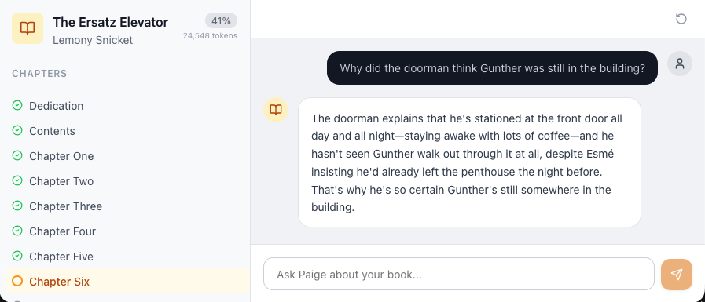

# Paige

Chat about your books without spoilers.



Paige is a web app that lets you discuss any book with AI while respecting exactly how far you've read. Upload an EPUB, set your progress by chapter, and chat freely — Paige will never reveal what happens next.

## Features

- **EPUB upload & parsing** — drag and drop your book to get started
- **Chapter-level progress tracking** — tell Paige how far you've read
- **Spoiler-free AI chat** — powered by any model on OpenRouter (or a local server), constrained to only discuss what you've already read
- **Token usage & cost tracking** — see per-message and conversation-level token counts and costs
- **Responsive mobile UI** — slide-in sidebar and full mobile support

## How It Works

When you set your progress, Paige sends the full text of every chapter you've read directly into the LLM's context window. There's no RAG, no embeddings, no chunking — the model sees the complete, unbroken text of everything up to your current chapter.

This is an opinionated choice. The upside is that conversations are richer and more grounded, since the model has full access to every detail, callback, and nuance in what you've read. The tradeoff is that longer books use more tokens (and cost more), and very large books may approach context limits. On the cost side, because the book text is a stable prefix at the start of every request, it's compatible with prompt caching — so after the first message in a conversation, subsequent messages benefit from discounted cached token pricing. The per-message cost shown in the app is the actual amount OpenRouter charges, so that caching discount is reflected automatically (hover a reply to see its cost and how many input tokens were cached).

## Getting Started

### Prerequisites

- [Node.js](https://nodejs.org/) 20.9+
- An [OpenRouter](https://openrouter.ai/) API key (or a local OpenAI-compatible server — see [Using a local model](#using-a-local-model))

### Setup

```bash
git clone https://github.com/derekmpeterson/paige.git
cd paige
npm install
```

Create a `.env.local` file in the project root:

```
OPENROUTER_API_KEY=your-openrouter-api-key
```

Optionally configure the model (default shown):

```
MODEL_ID=x-ai/grok-4.3
```

`MODEL_ID` is any [OpenRouter model ID](https://openrouter.ai/models) (Grok is just the default). Pricing for cost tracking is fetched automatically from the OpenRouter API.

Start the dev server:

```bash
npm run dev
```

Open [http://localhost:3000](http://localhost:3000) in your browser.

### Using a local model

Instead of OpenRouter, you can point Paige at any local OpenAI-compatible server
(for example [llama.cpp](https://github.com/ggml-org/llama.cpp)'s `llama-server`).
Set `LLAMA_SERVER_URL` and Paige will use it instead of OpenRouter — no API key required:

```
LLAMA_SERVER_URL=http://localhost:8080/v1
LLAMA_MODEL_ID=your-local-model-id
```

When `LLAMA_SERVER_URL` is set it takes precedence over the OpenRouter configuration.
Cost tracking is OpenRouter-specific, so it is disabled for local models.

## Limitations & design notes

Paige is built as a **single-user, self-hosted app**, and a few choices follow from that:

- **In-memory book storage.** Parsed books live in server memory, not a database, so
  they are lost when the server restarts. Re-upload to continue.
- **No authentication or rate limiting.** Run it locally or behind your own access
  controls; it is not hardened for exposure as a public multi-user service.
- **Approximate token counts.** Counting uses the GPT-4o tokenizer
  ([js-tiktoken](https://github.com/dqbd/tiktoken)) as a model-agnostic estimate, so
  numbers may differ slightly from a given model's exact tokenizer.

## Tech Stack

- [Next.js](https://nextjs.org/) & React
- TypeScript
- [Vercel AI SDK](https://sdk.vercel.ai/) with [OpenRouter](https://openrouter.ai/) (any model) or a local OpenAI-compatible server
- [Tailwind CSS](https://tailwindcss.com/)
- [Radix UI](https://www.radix-ui.com/)
- [epub2](https://github.com/nickcis/epub2) for EPUB parsing

## Contributing

Contributions are welcome! Please read [CONTRIBUTING.md](CONTRIBUTING.md) for local
setup, the checks to run before opening a pull request, and project conventions. By
participating you agree to abide by the [Code of Conduct](CODE_OF_CONDUCT.md).

## Testing

```bash
npm test          # run the unit test suite once
npm run test:watch # watch mode
```

## License

[MIT](LICENSE)
